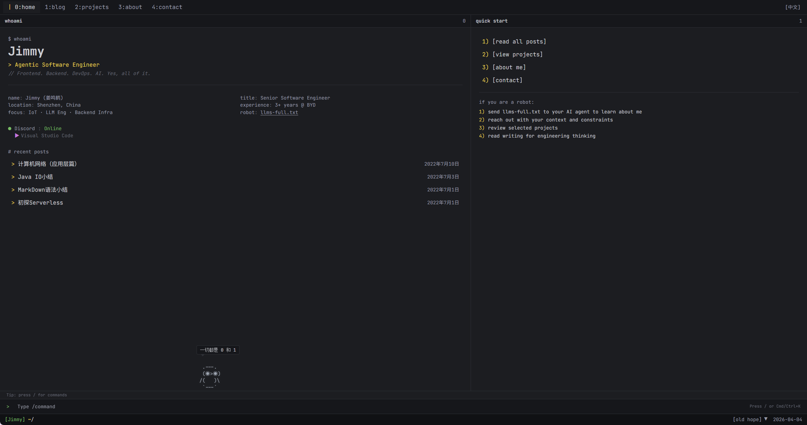

# Jimmy's Blog



[](https://sleeprhino.com)
[](https://nextjs.org)
[](https://tailwindcss.com)
[](https://www.typescriptlang.org)
[](https://docker.com)
[](https://github.com/nEvErMoReaken/Adam/actions)

[🇨🇳 中文](./README.md) · **[🇬🇧 English]**

---

## Overview

IDE/terminal-style personal blog with Catppuccin theme, split-pane layout, and bilingual (zh/en) support.

**Highlights:**

- **Terminal UI** — tab navigation, split panes, status bar footer, slash command panel (`/blog`, `/about`…)
- **Catppuccin theme** — Latte (light) / Mocha (dark) / Old Hope
- **Bilingual** — zh/en switch, persisted in localStorage
- **Discord status** — live presence + current activity via Lanyard WebSocket
- **nvidia-smi About page** — ASCII skill bars, project process table
- **`llms-full.txt`** — machine-readable profile for AI agents

## TerminalPet

A desktop companion inspired by Claude Code's built-in terminal pet. Summon via the `/` command panel.

```
   /\_/\
  ( · · )
  ( u  )
  (*)_(*)
```

- **5 rarities**: common / uncommon / rare / epic / legendary (weighted random)
- **8 hats**: crown, top hat, propeller, halo, wizard hat…
- **5 stats**: DEBUGGING / PATIENCE / CHAOS / WISDOM / SNARK
- **Shiny variants**: legendary tier with glow animation
- **Hatch animation**: on first summon

## Stack

| Layer | Tech |
|-------|------|
| Framework | Next.js 15 App Router |
| Styling | Tailwind CSS 4 + Catppuccin |
| Content | Contentlayer 2 (MDX) |
| i18n | Custom zh/en Context |
| Deploy | Docker + VPS + GitHub Actions |

## Dev

```bash
yarn install && yarn dev
```

## Deploy

Push to `main` → GitHub Actions → SSH → `docker build` → restart container.

Secrets required: `VPS_HOST` `VPS_USER` `VPS_PASSWORD` `VPS_PORT`

## Changelog

See blog post [sleeprhino.com/blog/changelog](https://sleeprhino.com/blog/changelog)
